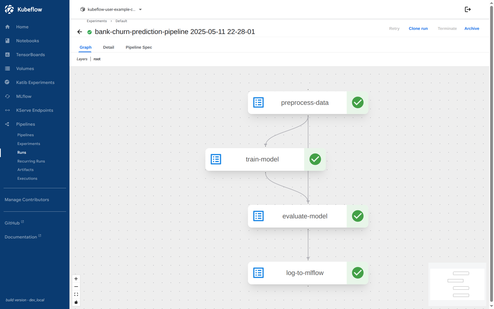
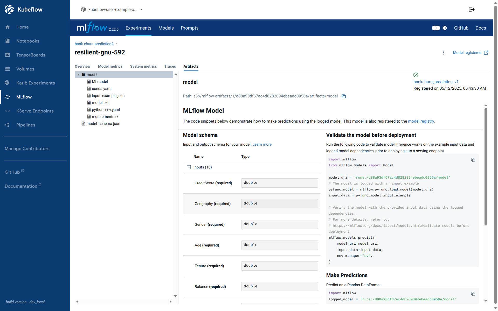
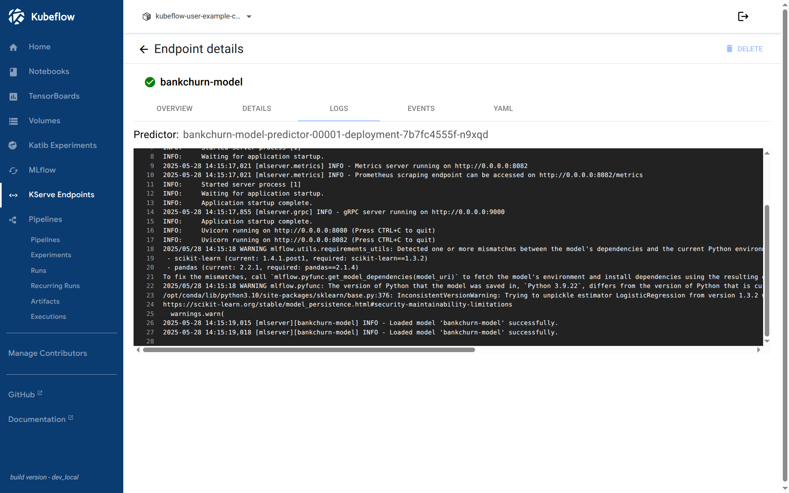

# MLOps with Kubeflow and MLflow Integration

## Table of Contents
- [Overview](#overview)
- [Prerequisites](#prerequisites)
- [Installation Guide](#installation-guide)
  - [Setting up MLflow in Kubeflow](#setting-up-mlflow-in-kubeflow)
  - [Configuring Database and Storage](#configuring-database-and-storage)
  - [Service Mesh Configuration](#service-mesh-configuration)
- [Pipeline Development](#pipeline-development)
- [Model Serving](#model-serving)
- [Testing and Validation](#testing-and-validation)
- [Troubleshooting](#troubleshooting)

## Overview

This project demonstrates a complete MLOps pipeline integration using Kubeflow and MLflow on Kubernetes. The setup provides:

- **Experiment Tracking**: MLflow for model versioning and experiment management
- **Pipeline Orchestration**: Kubeflow Pipelines for ML workflow automation
- **Model Serving**: KServe for scalable model deployment
- **Storage Backend**: MinIO for artifact storage and MySQL for metadata
- **Service Mesh**: Istio for secure service communication

## Prerequisites

### Required Components
- Kubernetes cluster (RKE2 used in the experimentation)
- Kubeflow installation (visit `kubeflow/manifests`)
- Helm 3.x
- kubectl configured for your cluster

### Storage Considerations
- **Development**: Local path provisioner (visit https://github.com/rancher/local-path-provisioner)
- **Production**: NFS, CephFS, or MinIO DirectPV recommended

### Network Requirements
- Istio service mesh configured
- Port forwarding capabilities for initial setup

## Installation Guide

### Setting up MLflow in Kubeflow

#### Step 1: Configure MySQL Database

1. **Port Forward MySQL Service**
```bash
kubectl port-forward svc/mysql -n kubeflow 3306:3306
```

2. **Create MLflow Database and User**
```bash
mysql -h 127.0.0.1 -u root
```

Execute the following SQL commands:
```sql
CREATE DATABASE mlflow;
CREATE USER 'mlflow_user'@'%' IDENTIFIED BY 'mlflow_password123';
GRANT ALL PRIVILEGES ON mlflow.* TO 'mlflow_user'@'%';
FLUSH PRIVILEGES;
```

#### Step 2: Configure MinIO Storage

1. **Port Forward MinIO Service**
```bash
kubectl port-forward svc/minio-service -n kubeflow 9000:9000
```

2. **Create MLflow Bucket**
- Access MinIO UI at `http://localhost:9000`
- Login with credentials: `minio` / `minio123`
- Create bucket named `mlflow-artifacts`

#### Step 3: Install MLflow via Helm

1. **Add Helm Repository**
```bash
helm repo add community-charts https://community-charts.github.io/helm-charts
helm repo update
```

2. **Install MLflow**
```bash
helm install mlflow community-charts/mlflow \
  --namespace kubeflow \
  --set backendStore.mysql.enabled=true \
  --set backendStore.mysql.host=mysql.kubeflow.svc.cluster.local \
  --set backendStore.mysql.port=3306 \
  --set backendStore.mysql.database=mlflow \
  --set backendStore.mysql.user=mlflow_user \
  --set backendStore.mysql.password=mlflow_password123 \
  --set artifactRoot.s3.enabled=true \
  --set artifactRoot.s3.bucket=mlflow-artifacts \
  --set artifactRoot.s3.awsAccessKeyId=minio \
  --set artifactRoot.s3.awsSecretAccessKey=minio123 \
  --set extraEnvVars.MLFLOW_S3_ENDPOINT_URL=http://minio-service.kubeflow.svc.cluster.local:9000
```

### Service Mesh Configuration

#### Configure Istio Authorization Policies

1. **MySQL Access Policy**
```yaml
apiVersion: security.istio.io/v1beta1
kind: AuthorizationPolicy
metadata:
  name: mysql
  namespace: kubeflow
spec:
  selector:
    matchLabels:
      app: mysql
  rules:
  - from:
    - source:
        principals:
        - cluster.local/ns/kubeflow/sa/ml-pipeline
        - cluster.local/ns/kubeflow/sa/ml-pipeline-ui
        - cluster.local/ns/kubeflow/sa/ml-pipeline-persistenceagent
        - cluster.local/ns/kubeflow/sa/ml-pipeline-scheduledworkflow
        - cluster.local/ns/kubeflow/sa/ml-pipeline-viewer-crd-service-account
        - cluster.local/ns/kubeflow/sa/kubeflow-pipelines-cache
        - cluster.local/ns/kubeflow/sa/metadata-grpc-server
        - cluster.local/ns/kubeflow/sa/mlflow

---
apiVersion: networking.istio.io/v1alpha3
kind: DestinationRule
metadata:
  name: ml-pipeline-mysql
  namespace: kubeflow
spec:
  host: mysql.kubeflow.svc.cluster.local
  trafficPolicy:
    tls:
      mode: ISTIO_MUTUAL
```

2. **Network Policy for MLflow**
```yaml
apiVersion: networking.k8s.io/v1
kind: NetworkPolicy
metadata:
  name: mlflow-allow-ingress
  namespace: kubeflow
spec:
  podSelector:
    matchLabels:
      app: mlflow
  policyTypes:
    - Ingress
  ingress:
    - from:
        - podSelector: {}
        - namespaceSelector: {}
      ports:
        - protocol: TCP
          port: 5000
```

3. **MLflow Authorization Policy**
```yaml
apiVersion: security.istio.io/v1beta1
kind: AuthorizationPolicy
metadata:
  name: allow-mlflow-all-sources
  namespace: kubeflow
spec:
  selector:
    matchLabels:
      app: mlflow
  action: ALLOW
  rules:
  - to:
    - operation:
        methods: ["GET", "POST", "PUT", "DELETE", "HEAD", "OPTIONS"]
        ports: ["5000"]
```

#### Integrate MLflow into Kubeflow Dashboard

1. **Create Virtual Service**
```yaml
apiVersion: networking.istio.io/v1beta1
kind: VirtualService
metadata:
  name: mlflow
  namespace: kubeflow
spec:
  gateways:
  - kubeflow-gateway
  hosts:
  - '*'
  http:
  - match:
    - uri:
        prefix: /mlflow/
    rewrite:
      uri: /
    route:
    - destination:
        host: mlflow.kubeflow.svc.cluster.local
        port:
          number: 5000
```

2. **Update Kubeflow Dashboard Configuration**
Add this entry to the dashboard menu configuration:
```yaml
{
    "type": "item",
    "link": "/mlflow/#",
    "text": "MLflow",
    "icon": "icons:cached"
}
```

## Pipeline Development

### Enable Pipeline Submission from Notebooks

1. **Create PodDefault for Pipeline Access**
```yaml
apiVersion: kubeflow.org/v1alpha1
kind: PodDefault
metadata:
  name: access-ml-pipeline
  namespace: kubeflow-user-example-com
spec:
  desc: Allow access to Kubeflow Pipelines
  selector:
    matchLabels:
      access-ml-pipeline: "true"
  env:
    - name: KF_PIPELINES_SA_TOKEN_PATH
      value: /var/run/secrets/kubeflow/pipelines/token
  volumes:
    - name: volume-kf-pipeline-token
      projected:
        sources:
          - serviceAccountToken:
              path: token
              expirationSeconds: 7200
              audience: pipelines.kubeflow.org
  volumeMounts:
    - mountPath: /var/run/secrets/kubeflow/pipelines
      name: volume-kf-pipeline-token
      readOnly: true
```

2. **Create RoleBinding for User Access**
```yaml
apiVersion: rbac.authorization.k8s.io/v1
kind: RoleBinding
metadata:
  name: allow-kubeflow-user-example-com-kubeflow-edit
  namespace: kubeflow
roleRef:
  apiGroup: rbac.authorization.k8s.io
  kind: ClusterRole
  name: kubeflow-edit
subjects:
  - kind: ServiceAccount
    name: default-editor
    namespace: kubeflow-user-example-com
```

After creating PodDefatul configuration, when creating a new Kubeflow Notebook, you'll see this option


### Pipeline Example

Example pipeline code is available in `/bank_churn_test/deploy/pipeline/kubeflow_pipeline/`


## Model Serving

### Setup Model Serving Infrastructure

1. **Create MinIO Access Secret**
```yaml
apiVersion: v1
kind: Secret
metadata:
  name: minio-kserve-secret
  namespace: kubeflow-user-example-com
  annotations:
    serving.kserve.io/s3-endpoint: "minio-service.kubeflow.svc.cluster.local:9000"
    serving.kserve.io/s3-usehttps: "0"
    serving.kserve.io/s3-useanoncredential: "false"
type: Opaque
stringData:
  AWS_ACCESS_KEY_ID: "minio"
  AWS_SECRET_ACCESS_KEY: "minio123"
```

2. **Create Service Account**
```yaml
apiVersion: v1
kind: ServiceAccount
metadata:
  name: sa-minio-kserve
  namespace: kubeflow-user-example-com
secrets:
  - name: minio-kserve-secret
```

### Deploy Model with KServe
Remember to copy the model artifact path to serve it


1. **Create InferenceService**
```yaml
apiVersion: serving.kserve.io/v1beta1
kind: InferenceService
metadata:
  name: bankchurn-model
  annotations:
    sidecar.istio.io/inject: "false"
spec:
  predictor:
    serviceAccountName: sa-minio-kserve
    model:
      modelFormat:
        name: mlflow
      protocolVersion: v2
      storageUri: "s3://mlflow-artifacts/1/d88a93df67ac4d8282894ebeadc0956a/artifacts/model/" # Our model's artifact path. Replace with yours.
```


## Testing and Validation

### Model Inference Testing

1. **Port Forward KServe Service** (if needed)
```bash
kubectl port-forward svc/bankchurn-model-predictor-00001-private -n kubeflow-user-example-com 18080:8012
```

2. **Test Model Prediction**
```bash
curl -X POST http://localhost:18080/v2/models/bankchurn-model/infer \
  -H "Content-Type: application/json" \
  -d '{
    "inputs": [
      {"name": "CreditScore", "datatype": "FP64", "shape": [1], "data": [850]},
      {"name": "Geography", "datatype": "FP64", "shape": [1], "data": [1]},
      {"name": "Gender", "datatype": "FP64", "shape": [1], "data": [0]},
      {"name": "Age", "datatype": "FP64", "shape": [1], "data": [43]},
      {"name": "Tenure", "datatype": "FP64", "shape": [1], "data": [2]},
      {"name": "Balance", "datatype": "FP64", "shape": [1], "data": [125510.82]},
      {"name": "NumOfProducts", "datatype": "FP64", "shape": [1], "data": [1]},
      {"name": "HasCrCard", "datatype": "FP64", "shape": [1], "data": [1]},
      {"name": "IsActiveMember", "datatype": "FP64", "shape": [1], "data": [1]},
      {"name": "EstimatedSalary", "datatype": "FP64", "shape": [1], "data": [79084.1]}
    ]
  }'
```

3. **Expected Response**
```json
{
    "model_name": "bankchurn-model",
    "id": "07040ee6-9980-4c66-a81c-6bd9aa4fede3",
    "parameters": {
        "content_type": "np"
    },
    "outputs": [
        {
            "name": "output-1",
            "shape": [
                1,
                1
            ],
            "datatype": "INT64",
            "parameters": {
                "content_type": "np"
            },
            "data": [
                1
            ]
        }
    ]
}
```

## Troubleshooting

### Common Issues

1. **MySQL Connection Issues**
- Verify port forwarding is active
- Check MySQL service status: `kubectl get svc mysql -n kubeflow`
- Validate credentials and database creation

2. **MinIO Access Problems**
- Ensure bucket `mlflow-artifacts` exists
- Verify MinIO credentials
- Check service connectivity: `kubectl get svc minio-service -n kubeflow`

3. **MLflow UI Not Accessible**
- Verify VirtualService configuration
- Check Istio gateway status
- Validate authorization policies

4. **Model Serving Failures**
- Verify model artifact path in MinIO
- Check KServe logs: `kubectl logs -l serving.kserve.io/inferenceservice=bankchurn-model -n kubeflow-user-example-com`
- Validate service account permissions

### Useful Commands

```bash
# Check all resources in kubeflow namespace
kubectl get all -n kubeflow

# View MLflow logs
kubectl logs -l app=mlflow -n kubeflow

# Check KServe inference service status
kubectl get inferenceservice -n kubeflow-user-example-com

# Monitor pod status
kubectl get pods -n kubeflow -w
```

## Future plans

1. **Production Hardening**
- Implement proper storage solutions (NFS/CephFS)
- Configure TLS certificates
- Set up monitoring and logging

2. **Advanced Features**
- Multi-user isolation
- Advanced pipeline patterns
- Model monitoring

3. **Integration Examples**
- CI/CD pipeline and serving integration
- Automated retraining pipelines

For more examples and detailed implementation, refer to the `/bank_churn_test/` directory.